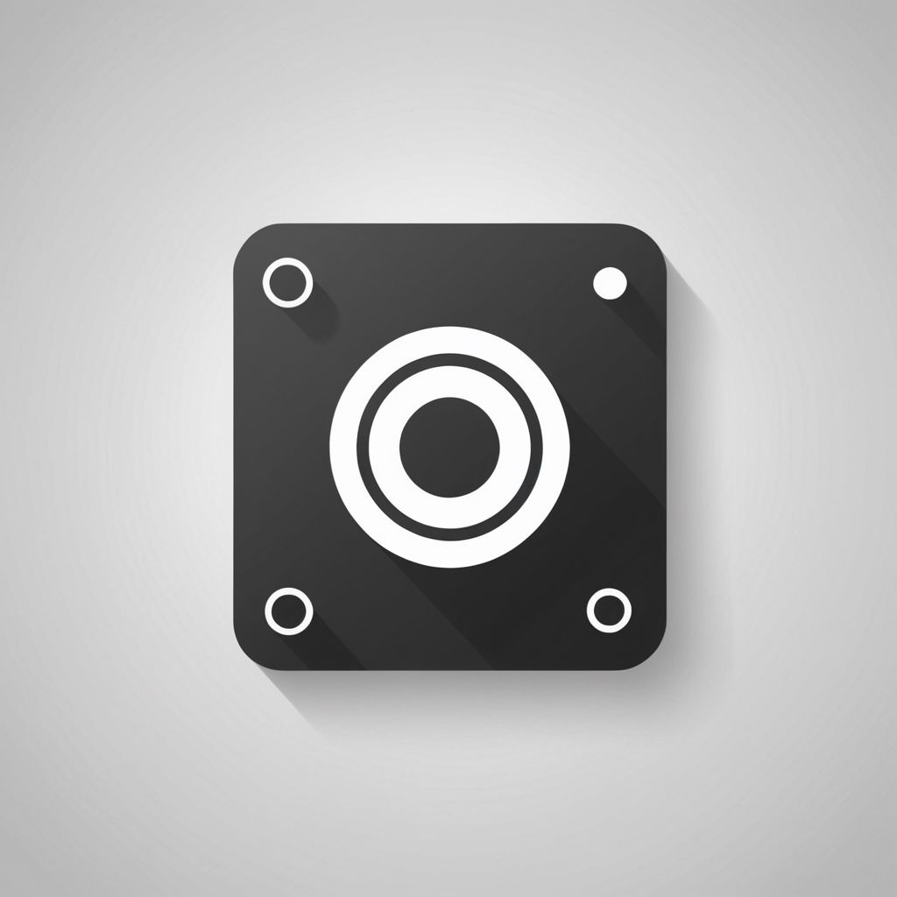
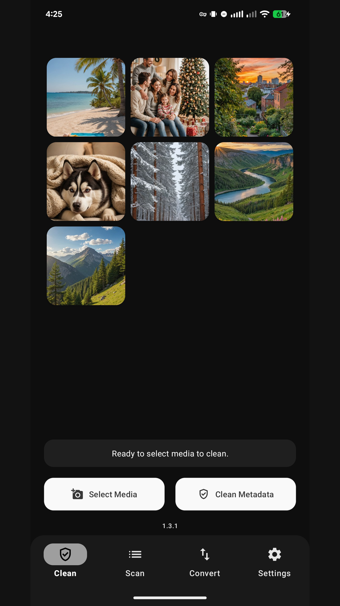
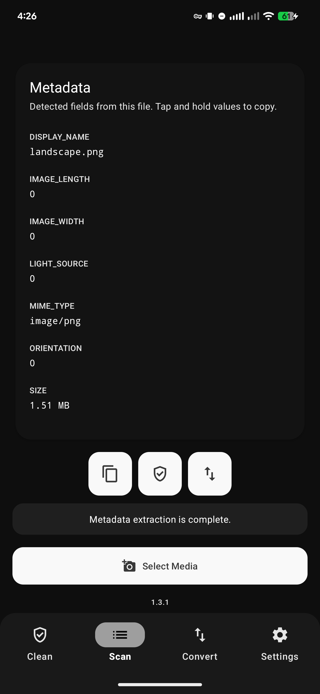

  
  
  
  
  

  
   
  

  
  

# Redact: Privacy & Metadata Remover

Protect your privacy with Redact — remove hidden EXIF and container metadata from photos and videos, inspect what is embedded before you share, and convert formats locally on your device.

**Take control of your digital footprint and share content on your terms.**

---

## Table of Contents

- [Features](#features)
- [Installation](#installation)
- [How It Works](#how-it-works)
- [FAQ](#faq)
- [Reporting Issues & Feedback](#reporting-issues--feedback)
- [Privacy & Security](#privacy--security)
- [License](#license)

---

## Key Features

- **Complete metadata cleaning:** Remove GPS, device info, timestamps, and hidden EXIF/XMP from images and videos. Strict Clean re-encodes video for maximum removal; a faster remux path is available when compatible.

- **Metadata scanner:** View organized metadata before cleaning. Copy fields, open a file in Clean, or send it to Convert.

- **Format conversion (local):** Convert images (JPEG, PNG, WebP, HEIC on supported devices) and transcode video (H.264, H.265, VP9, AV1) without cloud upload. **Convert changes format only** — run Clean afterward if you also want metadata stripped from converted files.

- **Batch processing:** Clean or convert up to **20 files** per batch. Partial success is reported when some items fail.

- **Share sheet integration:** Share photos or videos into Redact from any app. Optional confirmation dialog, cancelable progress, partial batch success, and automatic cleanup of temporary share files.

- **Privacy-first permissions:** On **Android 13+**, the system photo picker works without broad `READ_MEDIA_*` access. Optional `ACCESS_MEDIA_LOCATION` reveals GPS fields in Scan. Notifications and network access are **off by default**.

- **100% on-device processing:** Your media is never uploaded for core features. Optional crash reporting sends anonymized diagnostics only (see below).

- **13 languages:** English, Spanish, French, German, Italian, Portuguese, Russian, Japanese, Korean, Chinese (Simplified & Traditional), Hindi, and Arabic.

- **Open source & ad-free:** No ads or behavioral analytics. Code is on GitHub for community review.

---

## Installation

### Google Play Store

Install Redact through the [Google Play Store](https://play.google.com/store/apps/details?id=com.doubleangels.redact).

### Requirements

- **Minimum Android:** Android 12 (API 31)
- **Target Android:** API 37
- **Permissions:**
  - **Android 13+:** Optional `READ_MEDIA_IMAGES` / `READ_MEDIA_VIDEO` (or partial user-selected access on Android 14+) for reading existing gallery files. The **system photo picker** does not require broad library access for selecting files.
  - **Android 12 and below:** `READ_EXTERNAL_STORAGE` for gallery access.
  - **Optional:** `ACCESS_MEDIA_LOCATION` — needed to read GPS coordinates embedded in media during Scan.
  - **Optional:** `POST_NOTIFICATIONS` — for task-finished and progress alerts (master toggle off by default).

---

## How It Works

### 1. Gallery / in-app picker

1. Open **Clean**, **Scan**, or **Convert**.
2. Select up to 20 photos or videos (system photo picker on Android 13+).
3. **Clean** — strip metadata and save to `Pictures/Redact` or `Movies/Redact`.
4. **Scan** — view metadata; optionally grant photo-location permission to see GPS.
5. **Convert** — change format/codec; use **Clean** afterward if you need metadata removed too.

### 2. Share integration

1. Share a photo or video from any app to Redact.
2. Confirm stripping (if enabled in Settings).
3. Redact removes metadata locally, then opens the share chooser with clean file(s).
4. Cancel a long job from the progress dialog if needed.

All core processing runs locally. Optional crash reporting (off by default) may use the network for anonymized diagnostics only.

---

## FAQ

### What exactly is EXIF data?

EXIF (Exchangeable Image File Format) and related container metadata can include:

- GPS location coordinates
- Date, time, and timezone
- Device manufacturer and model
- Camera settings (aperture, shutter speed, ISO, etc.)
- XMP/IPTC and video container tags

### Does Redact alter the quality of my photos or videos?

Cleaning aims to preserve visual quality while removing metadata. Strict Clean and full video transcode re-encode video and may change encoding parameters. Image cleaning preserves orientation when possible.

### Does Convert remove metadata?

**No.** Convert changes format/codec only. Use the **Clean** tab (or share-in) to strip metadata.

### Does Redact need internet access?

**No**, for cleaning, scanning, and converting. If you enable **Send Crash Reports** in Settings (off by default) and grant network consent, anonymized crash diagnostics may be sent to [Sentry](https://sentry.io) over HTTPS.

### Where are processed files stored?

Cleaned and converted files are saved under `Pictures/Redact` and `Movies/Redact` in the MediaStore. Share-in uses app cache; temporary files are deleted after sharing (with a short delay so the target app can read them).

### What about secure delete and cache cleanup?

Settings let you overwrite temporary files before deletion (limited benefit on modern flash storage). **Clear Cache on Startup** removes processing cache files **older than 24 hours** when the app opens.

### Are there any analytics or trackers?

Optional crash reporting uses [Sentry](https://sentry.io). It is **disabled by default** and requires explicit network consent.

When enabled, anonymized data may include device model, Android version, app version, stack traces, and scrubbed diagnostic tags. URIs, filenames, and GPS are redacted before upload. Your photos and videos are **never** uploaded.

---

## Reporting Issues & Feedback

1. Check [GitHub Issues](https://github.com/doubleangels/redact/issues)
2. Open a new issue with steps to reproduce if needed

---

## Privacy & Security

- Files stay on your device for core features
- No network required for clean / scan / convert
- Open-source code for transparency
- Configurable secure deletion of temp files (flash-storage limitations apply)
- Share-in always strips location; Clean can preserve location only if you explicitly enable **Keep Location** (with confirmation) and Strict Clean is off
- Temporary and stale cache cleanup options in Settings

**[Privacy Policy](https://doubleangels.github.io/privacypolicy/redact.html)**

---

## License

Redact is released under the [GNU General Public License v3.0](LICENSE).

---

I hope you enjoy using Redact to protect your privacy online!
