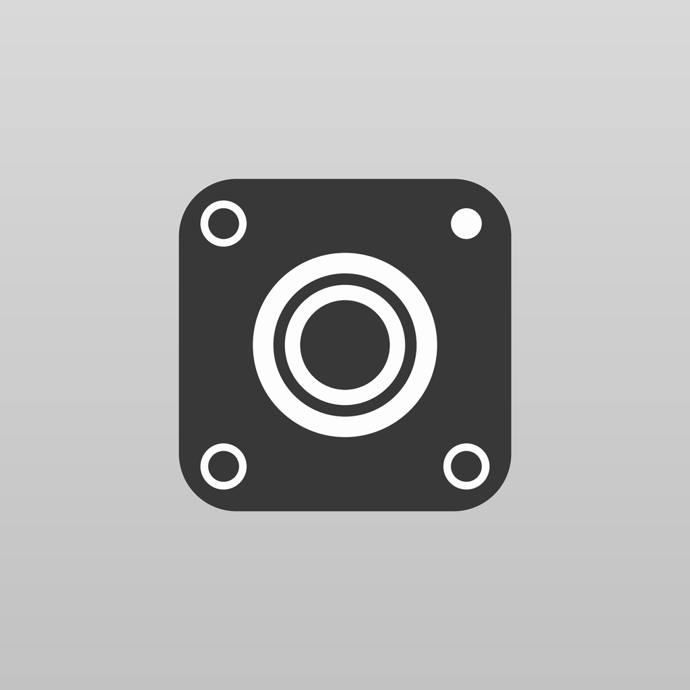
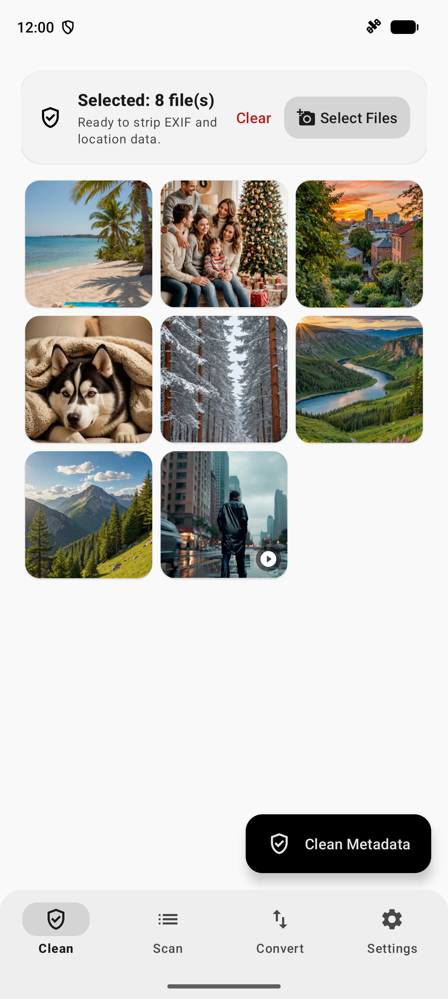
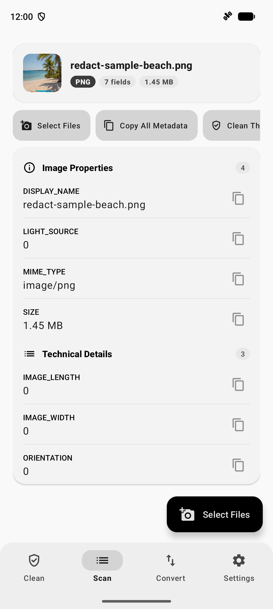
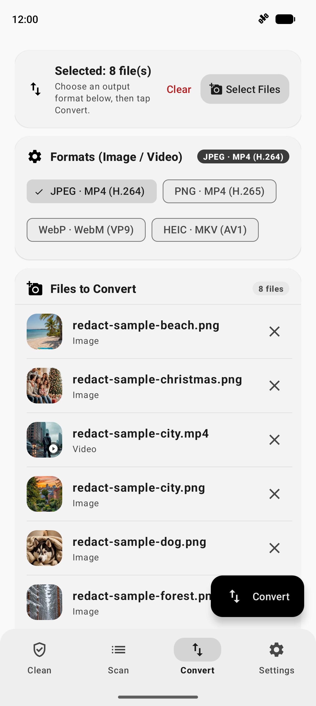
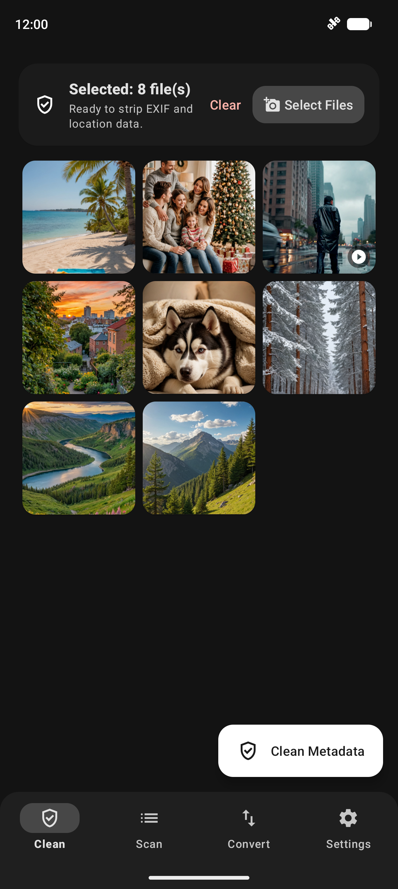

<p align="center">
  
</p>

<h1 align="center">Redact</h1>

<p align="center">
  <strong>Privacy &amp; metadata remover for Android.</strong><br>
  Strip the hidden location, device and time details from your photos and videos, check exactly what a file reveals before you share it, and convert formats, all on your phone.
</p>

<p align="center">
  <a href="https://play.google.com/store/apps/details?id=com.doubleangels.redact">
    
  </a>
</p>

<p align="center">
  
  
  
  
  
</p>

<p align="center">
  
  
  
  
</p>

---

## Table of Contents

**Using Redact**

- [What is Redact?](#what-is-redact)
- [Features](#features)
- [Getting started](#getting-started)
- [Using Redact](#using-redact)
- [Settings](#settings)
- [Privacy and security](#privacy-and-security)
- [FAQ](#faq)
- [Support and feedback](#support-and-feedback)

**Building and contributing**

- [For developers](#for-developers)
- [Contributing](#contributing)
- [Security](#security)
- [Built with](#built-with)
- [License](#license)

---

## What is Redact?

Every photo and video your phone takes carries a hidden label called **metadata**. Depending on your settings, that label can include:

- the **exact GPS location** where it was taken (often precise enough to find a house),
- the **date, time and time zone**,
- the **make and model** of your phone or camera,
- **camera settings** such as aperture, shutter speed and ISO,
- extra tags added by editing apps (XMP, IPTC and video container tags).

Most apps and websites do not show you this, but anyone who receives the original file can read it. Redact removes it, lets you inspect what a file contains before you send it, and converts between formats, **without your files ever leaving your device**.

> **Short version:** pick a photo or video, tap **Clean Metadata**, and share the clean copy that Redact saves to your gallery.

---

## Features

| | |
|---|---|
| **Clean** | Removes GPS coordinates, device details, timestamps and other hidden EXIF and container metadata from images and videos. Strict Clean re-encodes video for the most thorough removal; Faster Video Cleaning is available on compatible files. |
| **Scan** | Shows a file's metadata in an organized, readable list *before* you decide what to do. Rows that reveal where a file was taken carry a **Location** badge. Copy values, send the file to Clean or Convert, or open the location in your maps app. |
| **Convert** | Converts images between JPEG, PNG, WebP and HEIC (on supported devices) and video between H.264, H.265, VP9 and AV1. Converted files are stripped of metadata and checked afterward, so they do not carry the original's location or device details. |
| **Share into Redact** | Share a photo or video from any other app. Redact cleans it and reopens the share sheet with the clean copy, with an optional confirmation step and a progress dialog you can cancel. |
| **Batches** | Clean or convert up to 20 files at once. If some files fail, Redact keeps going and reports what succeeded. |
| **Large files** | There is no hard size cap. Redact warns you first when storage or memory looks too low for the job. |
| **Delete originals (optional)** | Turn on **Delete Originals After Cleaning** and Redact asks Android to move the originals to trash after a successful clean. Android shows its own confirmation, so nothing is removed without your say-so. |
| **Open source, no ads** | No ads and no behavioral tracking. The source is public for anyone to review. |
| **13 languages** | English, Spanish, French, German, Italian, Portuguese, Russian, Japanese, Korean, Chinese (Simplified and Traditional), Hindi and Arabic. Follows your phone's per-app language setting. |

---

## Getting started

### Install

[**Get Redact on Google Play**](https://play.google.com/store/apps/details?id=com.doubleangels.redact)

You can also build it yourself, see [For developers](#for-developers).

### Requirements

- Android 12 (API 31) or newer.
- A little free storage: Redact writes the cleaned copy next to your originals and warns you if space is tight.

### Your first clean

1. Open Redact and tap the **Clean** tab.
2. Tap **Select Files** and choose photos or videos.
3. Tap **Clean Metadata**.
4. Find the results in **Pictures/Redact** or **Movies/Redact**, or use the share button to send them straight away.

Your originals are never modified.

---

## Using Redact

### Clean

Removes metadata and saves a new copy to `Pictures/Redact` (images) or `Movies/Redact` (videos). Choose up to 20 files. Location data is removed unless you explicitly turn on **Keep Location** in Settings (this asks for confirmation and is ignored by Strict Clean).

### Scan

Pick **one** file to see everything embedded in it, grouped into sections such as image properties and technical details.

- **Location** badge: marks rows that reveal where the file was taken, such as GPS coordinates.
- **Copy:** copy a single value or the whole list. Copied values are flagged as sensitive on the clipboard on Android 13 and newer.
- **Open in Clean / Convert:** send the file on without picking it again.
- **Open location in maps:** hands the coordinates to your default maps app. Because that shares them with a separate app, Redact explains this and asks for permission the first time.
- To see GPS fields at all, grant the optional photo-location permission when asked.

### Convert

Choose a target format (images: JPEG, PNG, WebP, HEIC where supported; video: H.264, H.265, VP9, AV1) and Redact writes the converted copy with metadata stripped and verified. The format you pick is kept when you change the selection.

### Share into Redact

1. In any app, choose **Share** on a photo or video and pick **Redact**.
2. Confirm, if you have the confirmation step turned on.
3. Redact cleans the files locally and reopens the share sheet with the clean versions ready to send. Share-in always strips location data.
4. Cancel any time from the progress dialog.

### Where files go

Cleaned and converted files are saved through Android's MediaStore into `Pictures/Redact` or `Movies/Redact`. Files you share in are held in the app's temporary cache and deleted once sharing finishes, with a short delay so the receiving app can finish reading them.

---

## Settings

| Setting | What it does |
|---|---|
| **Strict Clean** | Removes every trace of metadata, even the orientation tag (a rotated photo may look sideways afterward), turns off the keep options, and always fully re-encodes video for the most thorough clean. |
| **Faster Video Cleaning** | When a video is already in a compatible format, strips its metadata with a quick pass instead of re-encoding. Faster and lighter on battery; a full re-encode removes a touch more. Turned off automatically with Strict Clean and for shared-in files. |
| **Keep Camera Settings** | Keeps aperture, shutter speed, ISO and camera make/model on the Clean tab. Ignored with Strict Clean and for shared-in files. |
| **Keep Location** | Keeps GPS coordinates on the Clean tab (confirmation required; off by default). Ignored with Strict Clean and for shared-in files, which always lose location. |
| **Delete Originals After Cleaning** | Asks Android to move the originals to trash after a successful clean. Android confirms each time. |
| **Warn About Already-Clean Files** | Before cleaning, tells you when selected files have no metadata to remove or are copies Redact already made, and lets you skip them, clean everything anyway or cancel. On by default; nothing about your files is stored to do this. |
| **Hide Content in Screenshots and Recents** | Blocks screenshots and screen recording inside Redact and blanks its preview on the recent apps screen, so metadata and thumbnails of private photos are not captured. Off by default; takes effect immediately. |
| **Confirm Before Removing Metadata** | Asks before cleaning files shared into Redact. |
| **Max Processing Resolution** | Largest image edge, in pixels, used when decoding. Lower values use less memory. |
| **Secure Deletion Passes** | How many times temporary files are overwritten before deletion. More passes are slower, and recovery may still be possible on flash storage. |
| **Clear Cache on Startup** / **Clear Temporary Files** | Removes processing cache older than 24 hours when the app opens, or on demand. |
| **Allow Notifications** / **Ongoing Task Progress** | Alerts when jobs finish and optional live progress. Off until you turn them on. |
| **Send Crash Reports** | Optional anonymized crash diagnostics through Sentry, off by default, with a consent prompt. |

Open the Settings tab in the app for the full list.

---

## Privacy and security

- **Your files stay on your device** for every core feature. Cleaning, scanning and converting never need a network connection.
- **No ads, no behavioral tracking, no analytics.**
- **Two optional things can touch the network or another app:**
  1. **Send Crash Reports** (off by default) sends anonymized diagnostics to [Sentry](https://sentry.io): device model, Android version, app version, stack traces and a few scrubbed tags. File paths, filenames and GPS coordinates are removed before anything is sent. Your photos and videos are **never** uploaded.
  2. **Open in maps** from Scan hands coordinates to your default maps app, only after your explicit one-time consent.
- **Permissions are minimal.** On Android 13 and newer Redact uses the system document picker, so it can reach Downloads, Files and gallery folders without broad media access.

| Permission | Why | Required? |
|---|---|---|
| `READ_MEDIA_IMAGES` / `READ_MEDIA_VIDEO` (or partial access on Android 14+) | Reading your gallery in some situations | Optional |
| `READ_EXTERNAL_STORAGE` | Gallery access on Android 12 and earlier | Where applicable |
| `ACCESS_MEDIA_LOCATION` | Lets Scan read GPS coordinates embedded in your media | Optional |
| `POST_NOTIFICATIONS` | Progress and completion notifications | Optional, off until you enable it |
| `FOREGROUND_SERVICE` | Keeps long clean or convert jobs running with a progress notification | Used during jobs |

- **Open source.** Read the code; that is the point.

**[Privacy Policy](https://doubleangels.github.io/privacypolicy/redact.html)**

---

## FAQ

<details>
<summary><b>What exactly is EXIF data?</b></summary>

EXIF (Exchangeable Image File Format) is the metadata block cameras and phones write into photos. Video files carry similar information in their container. Common contents: GPS location, date, time and time zone, device make and model, camera settings, and XMP / IPTC / container tags added by other apps.
</details>

<details>
<summary><b>Does Redact change the quality of my photos or videos?</b></summary>

Cleaning is designed to keep the picture looking the same while removing hidden metadata. Image cleaning preserves orientation whenever possible. Strict Clean and full video transcodes re-encode the video, which can change some encoding details.
</details>

<details>
<summary><b>Does Convert remove metadata too?</b></summary>

Yes. Images are re-encoded without their EXIF data. Videos have metadata removed before transcoding and are checked afterward. The original file is never modified.
</details>

<details>
<summary><b>Does Redact need an internet connection?</b></summary>

No. Only the two optional features above (crash reports and opening a location in a maps app) can use the network, and both are off until you choose them.
</details>

<details>
<summary><b>Where does Redact store my files?</b></summary>

In `Pictures/Redact` and `Movies/Redact`. See [Where files go](#where-files-go).
</details>

<details>
<summary><b>Are there file size limits?</b></summary>

No hard limit. Very large files can still strain a device that is low on storage or memory, so Redact warns you before it starts. Lowering **Max Processing Resolution** reduces memory use for large images.
</details>

<details>
<summary><b>Does Redact use analytics or trackers?</b></summary>

No. The only thing of this kind is the optional Sentry crash reporting described in [Privacy and security](#privacy-and-security).
</details>

<details>
<summary><b>Why does Scan show nothing about location?</b></summary>

Either the file has no location data, or you have not granted the optional photo-location permission, which Android requires before apps can read GPS fields in your photos.
</details>

<details>
<summary><b>Can I use Redact on Android 11 or older?</b></summary>

No, Android 12 (API 31) is the minimum.
</details>

---

## Support and feedback

- **Something not working?** Check the [FAQ](#faq) first, then look through the [existing issues](https://github.com/doubleangels/redact/issues) in case it has already been reported.
- **Found a bug or have an idea?** [Open an issue](https://github.com/doubleangels/redact/issues/new). Include your Android version, device model, app version and the steps to reproduce.
- **Please do not attach photos or files that contain private information** to a public issue. Describe them instead, or use a sample file.
- **Want to help translate?** See [Translations](#translations).

---

## For developers

### Requirements

- **JDK 21**
- **Android Studio** (recent stable) with the **Android SDK 37** installed
- An Android device or emulator on API 31 or newer (API 37 for the screenshots script)

### Build and run

```bash
git clone https://github.com/doubleangels/redact.git
cd redact

./gradlew assembleDebug      # build a debug APK
./gradlew installDebug       # build and install on the connected device or emulator
```

On Windows use `gradlew.bat`, or Git Bash.

### Test and lint

```bash
./gradlew testDebugUnitTest  # unit tests (Robolectric, no device needed)
./gradlew lintRelease        # Android Lint
```

CI runs `./gradlew test` and Android Lint on every push to `dev` and on every pull request.

### Optional: crash reporting while developing

Crash reporting is off unless a Sentry DSN is supplied at build time. Debug builds look for it, in order, in the `SENTRY_DSN` environment variable, a `sentry.dsn.local` file at the repo root (copy `sentry.dsn.local.example`; it is gitignored), or `sentry.dsn` in `local.properties`. Release builds read `SENTRY_DSN` from the environment only. You do not need a DSN to build, run or test the app.

### Project layout

```
app/src/main/java/com/doubleangels/redact/
  CleanFragment, ScanFragment, ConvertFragment, SettingsFragment   the four tabs
  MainActivity, ShareHandlerActivity                               entry points (share-in)
  media/          selecting, processing, converting, MediaStore writes, secure delete
  metadata/       reading (Scan) and stripping metadata
  notifications/  progress notifications and the foreground service
  permission/     permission checks and status
  sentry/         opt-in crash reporting and the privacy scrubber
  ui/             view models, adapters, clipboard helper
app/src/test/                  unit tests (Robolectric; fake MediaStore provider)
baselineprofile/               macrobenchmark module that generates the baseline profile
fastlane/metadata/             Google Play listing text, screenshots and icon
legal/                         source of the privacy policy page
scripts/screenshots.sh         captures store screenshots on an emulator
.github/workflows/             CI, release and privacy-policy publishing
```

### Baseline profile

Startup performance comes from a generated baseline and startup profile in `app/src/release/generated/baselineProfiles/`. Regenerate it on a connected device or emulator after meaningful startup-path changes:

```bash
./gradlew :app:generateBaselineProfile
```

If more than one device is connected, set `ANDROID_SERIAL` (for example `emulator-5554`) first.

### Store screenshots

`scripts/screenshots.sh` builds the debug app, boots (or reuses) an API 37 emulator, applies a black-and-white system theme, selects the sample media from `icons/sample`, and writes light and dark captures of Clean, Scan and Convert to `build/screenshots/`. Run it from Git Bash on Windows. See the header of the script for details.

### Releases

- Day-to-day work happens on the `dev` branch; dependency updates also target `dev`.
- A release is built from `main` by the manually triggered **Release Deployment** workflow: tests, lint, a signed app bundle, then publication to Google Play behind a protected `production` environment.
- The Play listing text and images come from `fastlane/metadata`.

### Translations

User-facing strings live in `app/src/main/res/values*/strings.xml`. When you add or change a string, add it to **every** locale folder (`ar`, `de`, `es`, `fr`, `hi`, `it`, `ja`, `ko`, `pt`, `ru`, `zh-rCN`, `zh-rTW`) and use plurals for counts. Machine-written translations are welcome to native-speaker corrections.

---

## Contributing

Contributions are welcome, from typo fixes and translations to new features. Read **[CONTRIBUTING.md](CONTRIBUTING.md)** for the workflow, the checks to run and the localization rules. In short: fork, branch from `dev`, add tests, run `./gradlew testDebugUnitTest` and `./gradlew lintRelease`, and open a pull request against `dev`.

Privacy is the product: changes that add network access, tracking, new permissions or new data collection need a clear justification and will get extra scrutiny.

---

## Security

Please do not report vulnerabilities in a public issue. See **[SECURITY.md](SECURITY.md)** for how to report one privately.

---

## Built with

Java, Android Jetpack and Material 3, [Media3 Transformer](https://developer.android.com/media/media3/transformer) for video, [AndroidX ExifInterface](https://developer.android.com/jetpack/androidx/releases/exifinterface) and [Apache Commons Imaging](https://commons.apache.org/proper/commons-imaging/) for metadata, [Glide](https://github.com/bumptech/glide) for thumbnails, [Sentry](https://sentry.io) for opt-in crash reporting, and [Robolectric](https://robolectric.org) and JUnit for tests. Releases are published with [Fastlane](https://fastlane.tools).

---

## License

Redact is released under the [GNU General Public License v3.0](LICENSE).

---

<p align="center">
  Thank you for trusting Redact to help protect your privacy. 💙
</p>
