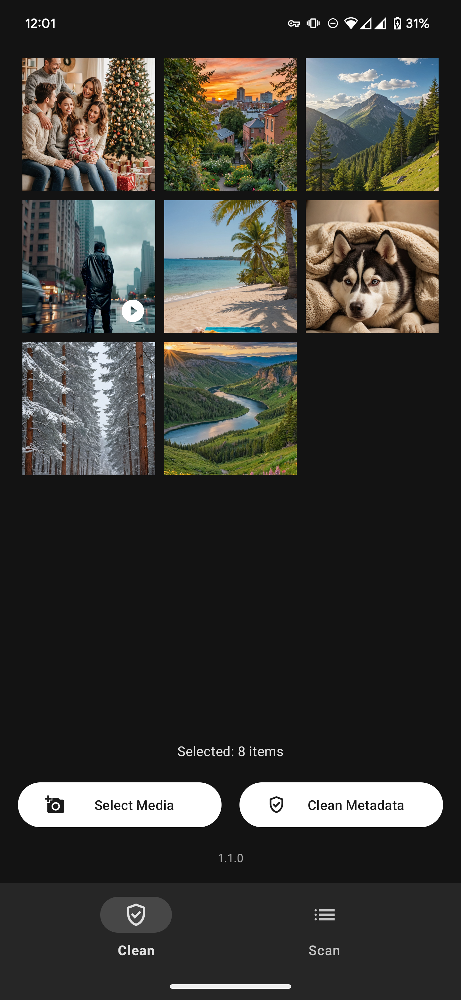
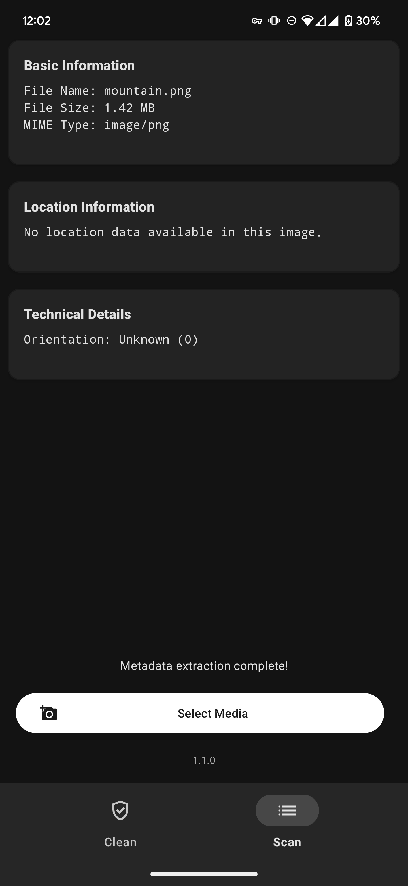

  
  
  
  
  

  
   
  

  
  

# Redact: Privacy & Metadata Remover

Protect your privacy with Redact - the powerful yet simple app that removes all EXIF metadata from photos and videos before sharing online. Prevent location tracking, hide device information, and secure your personal data when posting on social media platforms.

**Take control of your digital footprint and share content on your terms!**

---

## Table of Contents

- [Features](#features)
- [Installation](#installation)
- [How It Works](#how-it-works)

- [FAQ](#faq)

  - [What exactly is EXIF data?](#what-is-exif-data)
  - [Does Redact alter the quality of my photos or videos?](#quality-preservation)
  - [Does Redact need internet access?](#internet-access)
  - [Where are processed files stored?](#file-storage)
  - [Are there any analytics or trackers?](#analytics-tracking)

- [Reporting Issues & Feedback](#reporting-issues--feedback)
- [Privacy & Security](#privacy--security)
- [License](#license)

---

## Key Features:

- **Complete Privacy Protection & EXIF Cleaner:**  
  Remove all metadata including GPS location data, device information, timestamps, and personal details hidden in your media files.

- **Metadata Viewer & Inspector:**  
  Easily scan and view all hidden EXIF data in your photos and videos before completely removing it.

- **User-Friendly Privacy Interface:**  
  One-tap complete metadata removal makes protecting your digital privacy simple, quick, and accessible for everyone.

- **Bulk Photo & Video Processing:**  
  Clean multiple media files simultaneously, saving you time while enhancing your online privacy protection.

- **Original Quality Preservation:**  
  Remove all metadata without compressing or degrading your photos and videos - maintain full image quality.

- **100% Local & Secure Processing:**  
  All data cleaning happens directly on your device - your personal information never leaves your phone or connects to external servers.

- **Ad-Free & Open-Source Privacy Tool:**  
  Committed to transparency with no advertising, tracking, or data collection. Our code is fully open-source for community verification.

- **Android Share Sheet Integration:**  
  Seamlessly clean files from any app via Android's share menu and get back completely privacy-protected files ready to share.

Take control of your digital footprint! EXIF metadata can expose your precise GPS coordinates, device details, camera settings, timestamps, and unique identifiers. Redact eliminates all these privacy risks while preserving the quality of your media files.

---

## Installation

### Google Play Store

Install Redact through the [Google Play Store](https://play.google.com/store/apps/details?id=com.doubleangels.redact).

---

## How It Works

Redact helps you protect your privacy in two simple ways:

1. **Gallery Selection:**

   - Open Redact
   - Select multiple photos and videos
   - Tap once to remove EXIF data from all selected files
   - Share your cleaned files without privacy concerns

2. **Share Integration:**
   - When viewing a photo or video in any app
   - Use the share function
   - Select Redact from the share menu
   - Get back a clean file ready to share further

All processing happens locally on your device, with no internet connection required for core functionality. None of your files are ever sent to external servers.

---

## FAQ

### What exactly is EXIF data?

EXIF (Exchangeable Image File Format) data is hidden metadata embedded in photos and videos that can include:

- GPS location coordinates
- Date, time, and timezone information
- Device manufacturer and model
- Camera settings (aperture, shutter speed, etc.)
- Sometimes even unique identifiers

### Does Redact alter the quality of my photos or videos?

No. Redact is designed to preserve the original quality of your media files while removing only the metadata.

### Does Redact need internet access?

No. The core functionality works completely offline. Your files never leave your device.

### Where are processed files stored?

Cleaned files are saved to your device's storage in a designated folder for easy access.

### Are there any analytics or trackers?

This app uses [Google Firebase](https://firebase.google.com) and only collects anonymized data to help diagnose issues. The information I receive includes:

- **Device model and type**
- **Operating system version**
- **App version**
- **Battery life, memory usage, and storage status when an error occurs**
- **Connection type (Wi-Fi/cellular) and VPN status at the time of an error** (No IP addresses are collected or logged)
- **Detailed crash reports and error logs**
- **Performance metrics for specific code sections**

---

## Reporting Issues & Feedback

If you encounter any issues or have suggestions to improve Redact, please:

1. Check for existing issues in the [GitHub Issues](https://github.com/doubleangels/redact/issues) section
2. Open a new issue with a detailed description if your problem hasn't been reported

Your feedback helps make Redact better for everyone!

---

## Privacy & Security

Redact is built with privacy as its core principle:

- Your files remain yours, they never leave your device
- No network requests needed for core functionality
- Open-source code for transparency

Your privacy is not just a feature - it's the entire point of this app.

**[Read my full Privacy Policy](https://doubleangels.github.io/privacypolicy/redact.html)**

---

## License

Redact is released under the [GNU General Public License v3.0](LICENSE).

---

I hope you enjoy using Redact to protect your privacy online!
