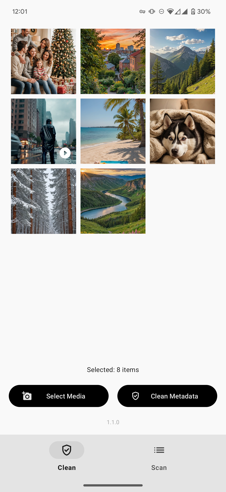

  
  
  
  
  

  
   
  

  

# Redact

Redact is a simple, powerful privacy-focused app that removes hidden metadata (EXIF data) from your photos and videos before sharing them online. This helps protect your privacy by eliminating personal information that could be exposed when sharing content on social media and other platforms.

**Take control of your digital footprint and share content on your terms!**

---

## Table of Contents

- [Features](#features)
- [Installation](#installation)
- [How It Works](#how-it-works)
- [FAQ](#faq)
- [Reporting Issues & Feedback](#reporting-issues--feedback)
- [Privacy & Security](#privacy--security)
- [License](#license)

---

## Features

- **Complete Privacy Protection:**  
  Remove hidden metadata that can reveal your location, device information, and personal details.

- **Intuitive Interface:**  
  One-tap metadata removal makes protecting your privacy simple and quick.

- **Batch Processing:**  
  Clean multiple photos and videos at once, saving you time and effort.

- **Original Quality Preservation:**  
  Remove metadata without compromising the quality of your media files.

- **Local Processing:**  
  All processing happens on your device - your data never leaves your phone.

- **No Ads & Open-Source:**  
  Committed to privacy with no advertising and fully transparent code.

- **Share Sheet Integration:**  
  Easily share files to Redact and get back clean files ready to share further.

---

## Installation

### Google Play Store

Install Redact through the Google Play Store.

---

## How It Works

Redact helps you protect your privacy in two simple ways:

1. **Gallery Selection:**

   - Open Redact
   - Select multiple photos and videos
   - Tap once to remove EXIF data from all selected files
   - Share your cleaned files without privacy concerns

2. **Share Integration:**
   - When viewing a photo or video in any app
   - Use the share function
   - Select Redact from the share menu
   - Get back a clean file ready to share further

All processing happens locally on your device, with no internet connection required for core functionality. None of your files are ever sent to external servers.

---

## FAQ

### What exactly is EXIF data?

EXIF (Exchangeable Image File Format) data is hidden metadata embedded in photos and videos that can include:

- GPS location coordinates
- Date, time, and timezone information
- Device manufacturer and model
- Camera settings (aperture, shutter speed, etc.)
- Sometimes even unique identifiers

### Does Redact alter the quality of my photos or videos?

No. Redact is designed to preserve the original quality of your media files while removing only the metadata.

### Does Redact need internet access?

No. The core functionality works completely offline. Your files never leave your device.

### Where are processed files stored?

Cleaned files are saved to your device's storage in a designated folder for easy access.

### Are there any analytics or trackers?

This app uses [Google Firebase](https://firebase.google.com) and only collects anonymized data to help diagnose issues. The information I receive includes:

- **Device model and type**
- **Operating system version**
- **App version**
- **Battery life, memory usage, and storage status when an error occurs**
- **Connection type (Wi-Fi/cellular) and VPN status at the time of an error** (No IP addresses are collected or logged)
- **Detailed crash reports and error logs**
- **Performance metrics for specific code sections**

---

## Reporting Issues & Feedback

If you encounter any issues or have suggestions to improve Redact, please:

1. Check for existing issues in the [GitHub Issues](https://github.com/doubleangels/redact/issues) section
2. Open a new issue with a detailed description if your problem hasn't been reported

Your feedback helps make Redact better for everyone!

---

## Privacy & Security

Redact is built with privacy as its core principle:

- No data collection
- No network requests for core functionality
- Open-source code for transparency

Your privacy is not just a feature - it's the entire point of this app.

**[Read my full Privacy Policy](https://doubleangels.github.io/privacypolicy/redact.html)**

---

## License

Redact is released under the [GNU General Public License v3.0](LICENSE).

---

I hope you enjoy using Redact to protect your privacy online!
